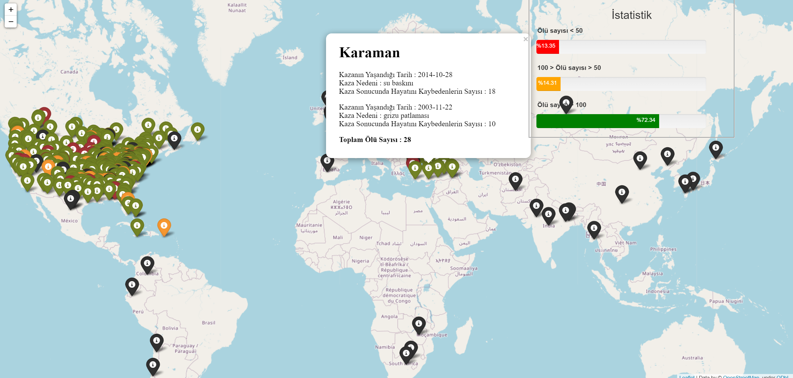

# World Mining Accidents Data Visualization Project

This project aims to extract and analyze data on mining accidents that have occurred globally, including their causes, injury numbers, and death tolls, and visualize them on a world map.
## Data Retrieval Process
During the data retrieval phase, we followed these steps:

Data Sources: We created our dataset by utilizing libraries such as Beautiful Soup to extract statistical data on accidents from specific sources.
Data Processing: We identified and cleaned important fields in the retrieved data, corrected missing or erroneous information, and prepared the data for analysis.

## Visualization Steps
The project includes the following steps:

Step 1: Data Examination
We analyzed the obtained data to understand the distribution of accidents and identified the most common causes.

Step 2: Map Visualization
Using Python and the Folium library, we visualized accidents on a world map.

Step 3: Analysis and Results
Utilizing the visualizations on the map, we analyzed the geographical distribution of mining accidents, as well as injury and death statistics.

## How to Use?
Download or clone the project files.
Install the required dependencies.
Run the main_script.py file to generate the map.
## Application Interface

